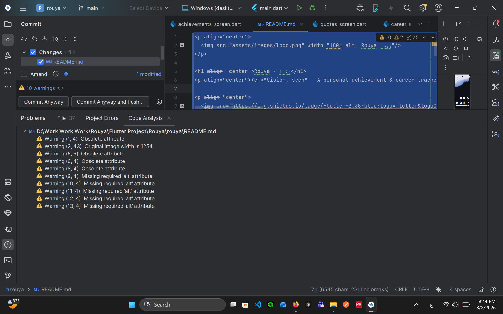

<p align="center">
  
</p>

<h1 align="center">Rouya · رؤيا</h1>
<p align="center"><em>"Vision, seen" — A personal achievement & career tracker</em></p>

<p align="center">
  
  
  
  
  
</p>

---

## What is Rouya?

Rouya (رؤيا — Arabic for *"vision"*) is a personal growth app built for ambitious professionals who want to track their achievements, career journey, teaching experience, and collect meaningful quotes — all in one beautifully designed dark-themed mobile app.

Built by a Senior Software Engineer with 865+ books read, 130+ students mentored, and a passion for building tools that reflect real growth.

---

## Screenshots

> *(Screenshots coming soon)*

---

## Features

### 🏠 Dashboard
- Personalized greeting
- Live achievement stats (total count, streak, interview breakdown)
- Top 3 categories with quick-increment
- Beautiful dark theme with gradient background

### 🏆 Goals / Achievements
- Fully custom achievement categories with emoji
- Increment and decrement counters
- Add and delete categories
- Real personal data: 865 books finished, 130 students mentored, 12 projects shipped

### 💼 Career
**Interviews tab:**
- Log job search interviews with company, role, type, outcome, notes, questions to revisit, and self-rating
- Edit and delete interview records
- Candidate survey results — live data from Supabase showing how candidates rated you as an interviewer
- Animated metric bubbles visualization (9.6/10 overall rating from 21 candidates)

**Teaching tab:**
- Track teaching programs with organization, student count, topics, and status
- Track individual students with subject, sessions, and progress rating
- Add, edit, and delete both programs and students

### 💬 Quotes
- Personal quotes library
- Favorite quotes
- Filter by All / Favorites
- Category tags (Becoming, Freedom, Discipline, Systems, Mind...)

### ⚙️ Settings
- Profile card with custom avatar (image picker)
- Two themes: **Feminine Power** (deep plum + electric rose) and **Obsidian** (dark + teal)
- Live theme preview and switcher
- Persistent preferences via SharedPreferences

---

## Supabase Integration

Rouya connects to Supabase to fetch real candidate survey data:

- Anonymous Google Form survey sent to candidates after each interview
- Google Apps Script automatically pushes aggregate results to Supabase
- App fetches and displays live ratings with animated bubble visualization
- **Real results: 9.6/10 overall rating from 21 candidates**

Survey dimensions tracked:
- Friendliness & Professionalism
- Candidate Comfort
- Question Relevance
- Fair Opportunity to Speak
- Process Clarity
- Overall Fairness

---

## Design

The UI is based on a high-fidelity prototype featuring:

- Deep plum `#1A0A2E` / near-black backgrounds
- Electric rose `#FF2D7A` and lavender `#C77DFF` accent colors
- Gold `#F2C76E` for streak and rating highlights
- Glass-morphism cards with subtle borders
- Cormorant Garamond serif + Manrope sans-serif typography
- Noto Kufi Arabic for the رؤيا wordmark
- Custom brand identity — رؤيا wordmark logo with 4-pointed spark

---

## Tech Stack

| Layer | Technology |
|---|---|
| Framework | Flutter 3.35 |
| Language | Dart 3.9 |
| State Management | Provider |
| Local Storage | SharedPreferences |
| Database | Supabase (PostgreSQL) |
| Survey Automation | Google Apps Script |
| Image Picker | image_picker |
| App Icon | flutter_launcher_icons |
| Fonts | Google Fonts + Noto Kufi Arabic |
| Notifications | flutter_local_notifications *(planned)* |

---

## Project Structure

```
lib/
├── main.dart
├── models/
│   ├── category_model.dart
│   ├── interview_model.dart
│   ├── quote_model.dart
│   └── teaching_model.dart
├── providers/
│   ├── app_state_provider.dart
│   └── theme_provider.dart
├── screens/
│   ├── main_shell.dart
│   ├── dashboard_screen.dart
│   ├── achievements_screen.dart
│   ├── career_screen.dart
│   ├── interviews_tab.dart
│   ├── teaching_tab.dart
│   ├── interview_detail_screen.dart
│   ├── log_interview_form.dart
│   ├── add_program_form.dart
│   ├── add_student_form.dart
│   ├── survey_results_screen.dart
│   ├── quotes_screen.dart
│   └── settings_screen.dart
├── services/
│   └── supabase_service.dart
└── theme/
    └── rouya_themes.dart
```

---

## Roadmap

- [x] Environment setup (Flutter + Android Studio)
- [x] Two-theme system (Feminine Power + Obsidian)
- [x] Navigation shell (5 tabs)
- [x] Dashboard with real personal stats
- [x] Achievements screen (CRUD + increment/decrement)
- [x] Career tab (Interviews + Teaching)
- [x] Rich interview log form (company, role, outcome, notes, questions to revisit)
- [x] Edit and delete interview records
- [x] Teaching programs and individual students (CRUD)
- [x] Quotes screen (favorites + filter)
- [x] Settings (profile + theme switcher + image picker)
- [x] Supabase integration (candidate survey ratings)
- [x] Animated survey results visualization
- [x] Custom brand logo and app icon
- [ ] Books database (save every book read)
- [ ] Courses database (save every course completed)
- [ ] Confetti celebration animations
- [ ] Daily quote notifications
- [ ] Wanas API integration for quotes
- [ ] Splash screen

---

## Real Data

This app reflects real personal achievements:

| Metric | Count |
|---|---|
| 📚 Books finished | 865 |
| 🎓 Students mentored | 130+ |
| 🚀 Projects shipped | 12 |
| 💼 Interviews conducted (as interviewer) | 32 |
| ⭐ Candidate rating | 9.6 / 10 |
| 🏆 Courses completed | 24+ |

---

## Getting Started

### Prerequisites
- Flutter 3.35+
- Android Studio 2025.1+
- Android SDK 35+

### Run

```bash
git clone https://github.com/SaraMahran/rouya.git
cd rouya
flutter pub get
flutter run
```

### Build APK

```bash
flutter build apk --release
```

---

## Developer

**Sara Ali Mahran**
Senior Software Engineer · Planning Engineer · Builder

- 🔗 [GitHub](https://github.com/SaraMahran)
- 💼 Building PESoftware — construction project management platform
- 🌸 Building Rouya — because growth deserves to be tracked beautifully

---

*Rouya رؤيا · v1.0.0 · 2026*